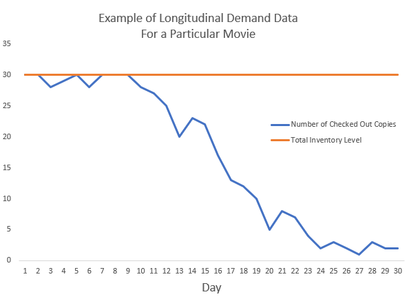

# Now Showing: Data Driven Solution for Movie Rentals {#Movie-Rentals}

#### Keywords {-}

Family Video, movie rentals, inventory management, data driven model


## Family Video, We Have a Problem 

Family Video owner, you are one of the few remaining brick and mortar movie rental stores and your rental prices are very competitive compared to online streaming websites. That’s why I have been your loyal customer for many years. However, from time to time I get disappointed when every copy of the movie I wanted to rent is checked out and you can’t give me an estimate when it will be available again. So I end up looking for other, usually more expensive, rental options. At the same time, I notice that other movies have dozens of copies available on the shelf. As your loyal customer and a data scientist, I would like to offer a data driven solution that optimizes your inventory management and revenue.


## Lights, Camera, Action!

Currently, there are at least two types of internal data available to you, one is customer transactional data and the other is inventory data. The customer transactional data details customer names, phone numbers, email addresses, checked out movies, check-out dates, intended return dates, actual return dates, etc. Inventory data contains a list of movies offered and the total number of copies ordered for each movie. You can bridge those two datasets together to find out the historical demand for each movie over time. Below is an illustration of the summarized daily longitudinal demand data for a particular movie. In this example, the number of checked out copies is equal to the total inventory level on Days 1, 2, 5, 8, and 9. Those data points are censored and thus the true demand is unknown. In other words, there was inventory deficiency on those days.

```{r BigIdea2-graph,echo=FALSE,fig.align='center',out.width='80%'}

```
The next step is to merge your longitudinal demand data with movie characteristics, such as genre, leading actors/actresses, director, box office sales, and audience rating. Tobit censored regression models [@mcdonald_uses_1980] can be used to build the initial demand model using historical demand as the target and movie characteristics as regressors. Random survival forests [@ishwaran_random_2008] can be used to forecast demand decay rates, varying by the initial demand projection. The combination of these two models will give you a reasonable prediction of rental demand over time. 

You should also sell off excess copies as early as possible because the longer you wait, the lower the sale price you will get due to lower demand. At the same time, you need to keep enough copies so that unanticipated variation in demand can be satisfied the vast majority of the time. I would recommend keeping the number of copies at the upper confidence limit of projected demand and selling off the rest. Last but not least, optimization algorithms can be applied to determine the optimal number of copies you should order that will maximize the sum of rental revenue and sale revenue net of purchase cost for each movie. 

As new movies release every week, you can repeatedly assess the performance of the demand model as well as the optimization strategy. You can continue to refine the model by tweaking different hyperparameters as well as incorporating new data.


## Two Thumbs Up

By carrying out my data driven solution, you will be able to better anticipate future rental demand and plan inventory accordingly. This enables you to satisfy your customers’ needs as much as possible so that they are less likely to seek out other rental options. In the event of shortage, the model allows you to provide an estimate to the customer when a particular movie will return in stock. Customers will feel some level of assurance that was not present before, and as a result they are more inclined to come back. The model also recommends a sale schedule for excess copies. This will free up shelf space and generate additional revenue. The additional room and capital can then be used for upcoming releases and the process begins anew. Most amazingly, the model is able to address all those customer pain points while optimizing revenue.

One shortcoming of this model is that it cannot predict shock demand due to special events. For example, during Oscar season, demand for Oscar nominated movies may increase dramatically as customers wish to view those movies for the first or second time. The model will have trouble extrapolating demand out for these movies, resulting in the same poor customer experience we have today. Given this happens for a limited subset of movies, this negative will not outweigh the positive benefits mentioned earlier. 
